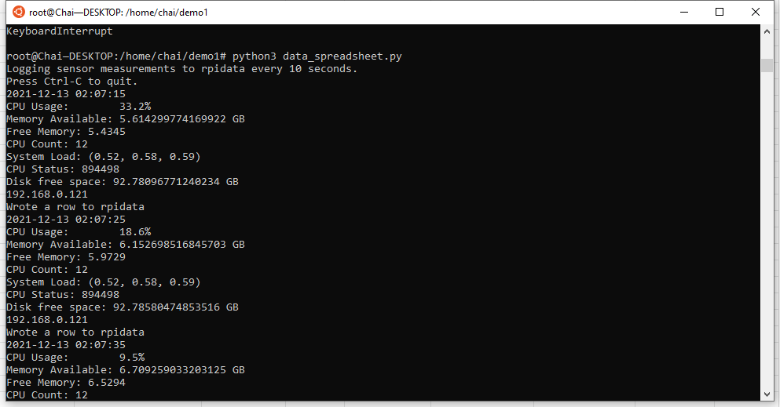

# Be sure to add the .json key file 
## And match the json key file with data_spreadsheet.py file after download the data_spreadsheet.py
### Documentation of psutil [(psutil)](https://psutil.readthedocs.io/en/latest/)

*psutil (python system and process utilities) is a cross-platform library for retrieving information on running processes and system utilization (CPU, memory, disks, network, sensors) in Python. It is useful mainly for system monitoring, profiling, limiting process resources and the management of running processes. 

### Install
```sh
$ pip install psutil
```

### Functions

* psutil.cpu_percent
    * Return a float representing the current system-wide CPU utilization as a percentage.
* psutil.virtual_memory().avaliable
    * The memory that can be given instantly to processes without the system going into swap.
* psutil.virtual_memory().free
    * The memory not being used at all (zeroed) that is readily available;
* psutil.cpu_count()
    * Return the number of logical CPUs in the system
* psutil.getloadavg()
    * Return the average system load over the last 1, 5 and 15 minutes as a tuple.
* psutil.cpu_status().interrupts
    * Time spent for servicing hardware interrupts
* psutil.disk_usage('/').free
    * Return disk usage statistics about the partition which contains the given path as a named tuple
* psutil.net_if_address()["eth0"][0]
    * Return the addresses associated to each NIC (network interface card) installed on the system. Under dict "eth0" the ‘0’ gives the first value "address" 


